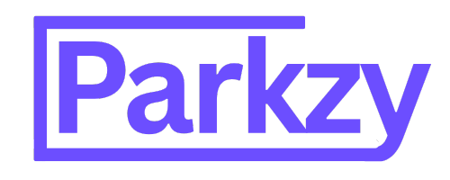

  

<h1 align="center">🚗 Parkzy</h1>

Find parking. Anywhere. Anytime.

---

### 🎥 Demo Video

  <video src="demo.mp4" width="600" controls></video>

---

## 🧠 What is Parkzy?

**Parkzy** is a peer-to-peer marketplace designed to solve one of the most frustrating urban problems: *parking availability*. We connect drivers who need a spot with property owners who have space to spare.

Whether you're a homeowner with a driveway that sits empty all day, an apartment complex with unused spaces, or a business with private parking — Parkzy helps you turn your space into revenue while helping drivers skip the circling.

### 🏡 For Spot Hosts
- List unused parking spots in seconds
- Earn money automatically every time a driver parks
- Optional **Parkzy physical signage** to show your spot is available
- Includes scheduling, pricing, and availability controls

### 🚘 For Drivers
- Find guaranteed parking when you actually need it
- Book last-minute or reserve in advance
- Filter by location, price, availability, and more
- Pay seamlessly through the app

---

## ✨ Key Features

| Feature | Description |
|--------|-------------|
| Peer-to-peer marketplace | Connecting hosts and drivers directly |
| Real-time availability | Know exactly what’s open before you drive |
| Secure payments | In-app payments with automatic host payouts |
| Host signage | Dedicated QR-code parking sign for visibility |
| Cross-platform | Native web & mobile support |
| Messaging system | Hosts and drivers can communicate easily |
| Smart scheduling | Hourly, daily, or custom pricing slots |

---

## 🏗️ Tech Stack

- **Frontend:** React + Vite + TypeScript, Tailwind CSS, shadcn/ui  
- **Backend & Database:** Supabase (Auth, Storage, Realtime, Edge Functions)  
- **Dev Tools:** GitHub, CI/CD, Resend for emails  

---

## 🚀 Our Mission

Parking shouldn’t be a treasure hunt.

Parkzy unlocks underutilized space across cities to:
- reduce traffic
- lower emissions
- make everyday travel less stressful
- enable passive income for local residents

Together, we’re **rebuilding the future of parking** — community-driven and effortless.

---

## 📬 Contact & Links

- 🌐 Website: useparkzy.com
- 📱 Mobile App: *Coming soon*
- 📧 hello@useparkzy.com  

---

Made with ❤️ in Los Angeles

